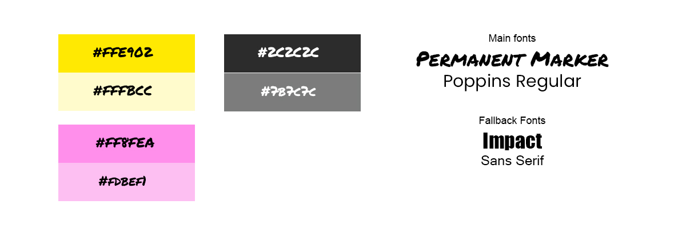

# Milestone 4 Project – Magnetic Eyes Lashes

My MS4 project Magnetic Eyes Lashes has been built using all of my knowledge gained from the Code Academy, Full Stack Developer Course, from start to finish. 

Magnetic Eyes Lashes is a fully responsive, custom-built full-stack website, designed and built with the users wants and needs first, whilst maintaining a high design standard and ease of use.

You can view the live website here. [Magnetic Eyes Lashes](https://magnetic-eyes.herokuapp.com/)

## Contents
1. [**Website Purpose**](#Website-Purpose)
2. [**UX**](#UX)
    -  [**User Stories**](#user-stories)
    -  [**Site Owner User Stories**](#Site-owner-user-stories)
3. [**Wireframes**](#wireframes)
4. [**WScope**](#scope)
5. [**Existing Website Features**](#existing-website-features)
    -  [**Future Features**](#features-to-add-in-the-future)
6. [**Schema Design**](#schema-design)
7. [**Testing**](#testing)
8. [**Technologies and Services Used**](#technologies-and-services-used)
    -  [**Tools Used**](#tools-used)
9. [**Deployment**](#deployment-to-heroku)
10. [**Repository Clone**](#clone-the-repository)
11. [**Secrey Key & Key Variables**](#secret-key-&-key-variables)
12. [**Design**](#design)
13. [**Credits**](#credits)
14. [**Acknowledgements**](#acknowledgements)

## Website Purpose:

Magnetic Eyelashes are a no glue, false lash alternative aimed at those who like the fuller lash look but unable to use lash glue, be it though allergy, choice, or an unsteady hand (like the owner!).

Magnetic Eyes Lashes primary purpose is to sell Magnetic False Eyelashes.

Website users will be able to create their own profiles to save their shipping details for faster purchasing, as well as view their past orders. 

Magnetic Eyes Lashes was a project I started some time ago when I discovered a gap in the market for these types of lashes. At the time, I was not able to build a website that I wanted due to my lack of knowledge and skill at the time. I have decided to bring this idea back to life and build it the website it deserves: a fully custom-built website with all the features it requires.

Website’s primary functions:
* Individual product purchase capability
* Authentication and authorisation mechanism for website subscribers and administrators
* User profiles containing past order info and default details
* Updating product listings with all CRUD functions
* A blog to provide news and additional information around the products

## UX

Target Audience:
The audience which the website targets are mostly, but not exclusively, female, who have an interest in makeup and beauty products. They are wanting to have a full lash look without using lash glue.

**New user goals:**
* Learn about the products on offer and the benefit they give 
* Purchase an item

## User Stories

**New user, user stories**

New visitors to the website should be provided with the answers they need right away. These include:
* As a new user, I want to be able to learn more about Magnetic Eyes lashes so that I can get to know the brand
* As a new user, I want to be able to understand how Magnetic Lashes work so that I can learn what the product is about and how to use them
* As a new user, I want to be able to easily view all eyelashes available so that I can decide which product I might like to learn more about
* As a new user, I want to be able to view details of a product so that I can learn more about that particular product
* As a new user, I want to be able to easily register for an account so that I can see and save my personal details for quicker ordering in the future

**Registered user, user stories:**

Registered users of the website will be provided with additional features which non-registered users will not benefit from. 
* As a registered user, I want to be able to easily log in and out of my account so that I can access my personal information and order history
* As a registered user, I want to be able to easily update my profile information so that I can update my personal details
* As a registered user, I want to be able to view my past orders so that I can keep track of my orders with the site
* As a registered user, I want to be able to have my delivery details prefilled so that I can save time in entering my details
* As a registered user, I want to be able to save my preferred payment details so that I can save time ordering in the future

**Website shopper user stories:**

All shoppers of the website, new, returning or registered:
* As a shopper, I want to be able to view all eyelashes available so that I can decide which product I might like to learn more about
* As a shopper, I want to be able to view details of a product so that I can learn more about that particular product
* As a shopper, I want to be able to choose the number of products I want to order so that I can decide how many of that product I would like to order
* As a shopper, I want to be able to add a product to my cart so that I can order my chosen product
* As a shopper, I want to be able to delete products from my cart so that I can update the products I would like to purchase
* As a shopper, I want to be able to update the number of products in my cart so that I can order more or less of the chosen product than I had originally intended
* As a shopper, I want to be able to use a secure payment method so that I can be confident my details are secure
* As a shopper, I want to be able to save my personal details from my order so that I can create an account and shop faster next time
* As a shopper, I want to be able to check out in a simple and easy way so that I can be confident my order has gone through with all my correct details
* As a shopper, I want to be able to receive an order confirmation so that I can be sure my order has gone through.
* As a shopper, I want to be able to learn more about Magnetic Eyes through blog articles, reviews and news, so that I can decide whether I want to buy their products
* As a shopper, I want to be able to view the latest products added to the store so that I can view the newest products and purchase them if I wish
* As a shopper, I want to be able to contact the website owner so that I can ask them a question

## The Site Owner:

The owner of the website wants to be able to sell their products is the easiest way possible. They also want to be able to educate and support the buyer with information on how these products work and how to use them, since they are different from the normal glue on false lashes.

They also want to be able to manage the site easily, with the ability to simply add, update and delete products listed without any complicated coding or website backend knowledge.

**Site owner goals:**
* Sell products to customers 
* Add, remove and update products
* Update the website with news and tips

**Site owner user stories:**
* As the site owner, I want to be able to easily list my products to sell so that I can sell new products to my users.
* As the site owner, I want to be able to update my product listings so that I can make sure the information is correct or amendments can be made.
* As the site owner, I want to be able to easily delete product listings so that I can remove items I no longer wish to sell.
* As the site owner, I want to be able to make it as easy as possible for users to purchase my products so that I can give them a great service, sell my products, and build a customer base
* As the site owner, I want to be able to teach website visitors about magnetic eyelashes so that I can sell them my products.
* As the site owner, I want to be able to run reports so that I can find out top-selling products, top customers and sales over certain periods.
* As the site owner, I want to be able to send auto emails to users so that I can inform them of successful registration and order confirmation.
* As the site owner, I want to be able to inform visitors of news and tips so that I can keep users returning and buying new products.

## Wireframes

## Scope:
* Users can learn about Magnetic Eyes Lashes
* Users can find an item to purchase
* Users can purchase an item

## Existing Website Features

**Navigation Bar:** The navbar is split into 3 sections with 2 navigation sections to make navigating the site easy. The first is the main navigation items for learning about products, contacting, reading the blog and most importantly, shopping for the products. The second is the details for MyAccount, with its sub-menu dependant on whether the users are already logged in or not, or is a superuser, and the bag which displays an up to date total of items in it.

**Sign up/Register & Sign In** This is found under the My Account menu item where users can log in to their account or register for the site.

**Delete product (superuser only):** Superusers can delete products easily either by clicking the delete button found under the items on the Shop page or the individual product page.

**Update product (superuser only):** Superusers can update the details of a product easily either by clicking the delete button found under the items on the Shop page, or on the individual product page, and then amending the form.

**Contact form:** The Contact page includes a form which submits messages from users directly to the site owner.

**Add item(s) to bag:** This button allows users to add items to the bag without navigating away from the page they are on. 

**Select item quantity:** On the product details page, users can select the number of items of that product they want to add to their basked using the + and – buttons, then ‘Add to Bag’

**Update item(s) Quantity:** On the bag page, users can update the number of items they wish to order of a product by changing the quantity number using the + and – buttons, then click the ‘update’ button

**Delete item(s) from the bag:** Users can remove an item from the bag completely by clicking the ‘remove’ button beneath the item in their bag.

**Back to the top on selected mobile pages:** Some pages of the website can become a little long on mobile. To help users with this I have added a ‘back to top’ button on these longer pages.

**Blog**: A blog is a perfect way for the website owner to provide useful information to users. This could include new product news, makeup tips and reviews from bloggers etc. The blog has been paginated so that it does not become too long, and users can also leave comments below a blog post.

## Features to add in the future:

* Defensive delete button: Currently, the Delete button to delete a product has no defence to stop it being automatically pressed. A confirmation of delete should be added.
* Leave reviews beneath products: Reading reviews are a great way to help users decide to purchase a product. This feature would be great to include in the future but was not seen as imperative for launch.
* Subscription purchase model: To entice users to regularly receive lashes, a subscription service would provide them with regular deliveries and a reduced cost. This would also benefit the website owner so that they have pre-orders already in place each month.

## Schema Design

## Testing

## Technologies and Services Used
* [HTML](https://html.com/)
* [CSS](https://www.w3.org/Style/CSS/Overview.en.html) 
* [JavaScript](https://www.javascript.com/) 
* [JavaQuery](https://jquery.com/)
* [Django]( https://www.djangoproject.com/)
* [GitHub](https://github.com/)
* [GitPod](https://www.gitpod.io/)
* [Heroku](https://www.heroku.com/)
* [Stripe](https://stripe.com)
* [Amazon Web Services]( https://aws.amazon.com/)

## Tools Used
* [Balsamiq](https://balsamiq.com/) - Used to create my wireframes, showing the positioning of elements on varying screen sizes.
* [Adobe Photoshop](https://www.adobe.com/uk/products/photoshop.html) - 
* [W3C HTML Validator](https://validator.w3.org/) - I used this tool to check the validity of my HTML code.
* [W3C CSS Validator](https://jigsaw.w3.org/css-validator/) - I used this tool to check the validity of my CSS code.
* [Autoprefixed](https://autoprefixer.github.io/) - I used this tool to check the prefixes of my CSS code.
* [PEP8](http://pep8online.com/) - I used this tool to check that my python files meet the PEP8 requirements.

## Deployment to Heroku
Once I got Magnetic Eyes to its MVP, I decided to deploy the project to Heroku so I could see, test and update the site in real-time. Here is my deployment process.

Read the full deployment process here. 

## Clone The Repository
Cloning the repository makes a copy of the repository which you download and store on your machine locally.
To make a clone of Magnetic Eyes and to run it locally, follow the following steps:
1. Visit the main repository of Magnetic Eyes [here](https://github.com/michellelclement/magnetic-eyes)
1. Above all the repository files and folders, you will find some buttons. Click on the one displaying ‘Code’ with a downward arrow and a download icon.
1. With the ‘HTTPS’ method selected, click the ‘copy’ button next to the URL. Here you will find the link you will need to copy. The link to copy Meatblog is: https://github.com/michellelclement/magnetic-eyes.git  
1. Open the working directory where you want the repository to be cloned to, and in the terminal use the command and hit enter: git clone https://github.com/michellelclement/magnetic-eyes.git
1. All the files will now be cloned into your chosen workspace.
1. Now you must set your environment variables. You can either do this by adding them to your Gitpod settings, or add a env.py.
1. Import os os.environ.setdefault("IP", "To be added by user")
1. To install the modules required on the requirements.txt file, run the command: pip3 install -r requirements.txt
1. You can run the code using the command: python3 manage.py runserver

The variables needed in your local repo are:
* EMAIL_HOST_PASS
* EMAIL_HOST_USER
* SECRET_KEY
* STRIPE_PUBLIC_KEY
* STRIPE_SECRET_KEY
* STRIPE_WH_SECRET
* STRIPE_WH_SECRET

If you add your variables in an env.py then **do not commit this page**. You will be making those variables available to the public. Instead, first you must create a file named .gitignore with the contents simply .env.py

## Secret Key & Key Variables
It is incredibly important to not store secret keys into version control. To stop this happening, I saved them all into key variables which we call from our settings.

In production and before deployment, these secret keys were stored in my GitPod settings and called using the command: os.environ.get('AWS_SECRET_ACCESS_KEY') for example.

Once deployed, as detailed above, all of the key variables were then copied into the Config Vars.

## Design

**Fonts**

I wanted to create a modern yet slightly funky website, whilst keeping a simple and high-quality design. To achieve this I decided to use the Permeant Marker for import and stand out header fonts. Upon testing, I noticed that this font didn’t always work on some browsers, even though Google Font documents stated they should. To combat this, I added two additional fall-back fronts. Unfortunately, no other fonts are like permanent Marker, so I added Impact font as the fallback and Sans Serif after that.

For the main body font, I decided to use Poppins Regular, as this complemented permanent Marker nicely and was clean and easy to read. I also made Sans Serif the fallback font for Poppins.

** Brand**

For the main brand, or logo, I went for a simple, font based logo with custom spacing. The letter-spacing is 5.6px on a desktop which reduces to 3.5 on mobile and uses the font Poppins in all capitals. 

**Colours**

I decided to use two main accent colours, in addition to the purple in the banner images. A nice bright yellow is used for shopping and info content and buttons, with bright pink for other content such as ‘add to bag’ and ‘checkout’ buttons. Both these colours are used sparingly and complement the purple, as well as the black and white lashes in the product images. I included a lighter, washed-out version of both colours for hover buttons.

Yellow: #FFE902

Light Yellow: #FFFBCC

Pink: #FF8FEA

Light Pink: #ff8fea

## Credits
**Blog Content:** Blog posts were previously submitted to me for Magnetic Eyes by bloggers [According to Alice](https://accordingtoalicex.com/2019/06/18/trichotillomania-make-up-tips/), [Black Tulip Beauty](https://www.blacktulipbeauty.co.uk/) and [Of Beauty & Nothinness](https://www.ofbeautyandnothingness.co.uk/) for use on the previous version of the Magnetic Eyes Lashes website and social media pages. Images used in those posts were also provided by both bloggers. Content of the blog posts were written by me, and link out to their respective blog posts.

**Images:** 
* Banner images: These images were from free stocksites [Pexels](https://www.pexels.com/discover/) and [Unsplash](https://unsplash.com/) and overlaid with a purple gradient design.
* Product images: All product images were taken by myself and are of my own products I used to sell.
* Homepage & Application page photos and video: All images and videos were taken and created by myself. The photo of the eye is my eye.
* [No Image Icon](https://www.freeiconspng.com/)

**Blog Implementation Tutorial**
In order to implement my brand new modules, I followed the following tutorials, with some additions of my own (such as adding images)
[Blog App](https://djangocentral.com/building-a-blog-application-with-django/)
[Blog Comments](https://djangocentral.com/creating-comments-system-with-django/)
[Blog Pagination](https://djangocentral.com/adding-pagination-with-django/)

**SendEmail (Contact Us) App Tutorial**
In order to add a contact app (or sendemail) I used the following tutorial to do so. I made some small amends, such as using Crispy Form instead of the suggested.
[Django Email Contact Form](https://learndjango.com/tutorials/django-email-contact-form)

## Acknowledgements
Special Thank you to my fantastic mentor ADEGBENGA ADEYE for all the help with this project.

I would also like to extend my thanks to the Tutors who helped me solve many of my errors and times when I became a bit stuck. These include Igor, Johann, Miklos, Samantha, Hevin, Hayley, Cormac and Roman.

Additional thankyou’s to the slack members to took the time to test out my site and assist with some issues or errors they spotted. These include Clint, Lucyjpjones and Sean Mc.